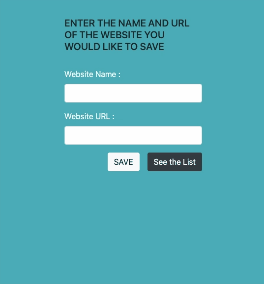

<h1 align="center"> BookMarker App using Bootstrap  👋</h1>


> Using Bootstrap, HTML , JS. I made BookMarker app  which it create Local Storage on Your Browser so you can save your Websites Names And URL and when you load the page many times you can see the list again 

### ✨ [Demo](https://mosaif00.github.io/BookMarker-App/)

 

**Built With :**
  - HTML
  - JS
  - BOOTSTRAP


## Usage

```sh
- Open the Website
- Enter the Website name and URL 
- Save 
- Go to SEE THE LIST to check your bookmarked websites
- Press Go to log into the website on the list 
```
## Issues
```sh
Delete Button in the BookMarker List need to be fixed 
```

## Author

👤 **MohammedSaif**

- Github: [@MoSaif00](https://github.com/MoSaif00)
- LinkedIn: [@linkedin\/in\/MoSaif00](https://linkedin.com/in/linkedin/in/MoSaif00)

## 🤝 Contributing

Contributions, issues and feature requests are welcome!<br />Feel free to check [issues page](https://github.com/MoSaif00/SImple-Weather-App/issues).

## Show your support

Give a ⭐️  if you like the project!


